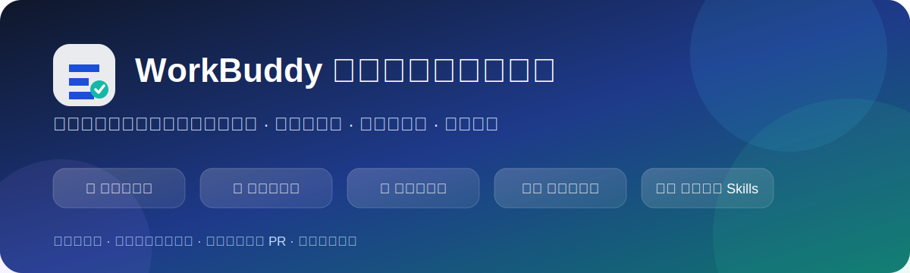

<p align="center">
  
</p>

<h1 align="center">WorkBuddy 非官方中文使用手册</h1>

<p align="center">
  面向普通人的 WorkBuddy 图文教程、工作流、可复制指令、Skills、自动化与故障排查。
</p>

<p align="center">
  <a href="https://github.com/yandong2023/workbuddy-guide/stargazers"></a>
  <a href="https://github.com/yandong2023/workbuddy-guide/actions/workflows/content-check.yml"></a>
  <a href="https://github.com/yandong2023/workbuddy-guide/issues"></a>
  <a href="LICENSE"></a>
  <a href="CONTENT_LICENSE.md"></a>
</p>

> 把分散在官方文档、社区文章、视频和真实案例中的信息，整理成普通用户能够照着完成的中文教程。

**项目原则：来源可追溯、未实测不冒充亲测、自动生成只进 PR、高风险操作必须人工确认。**

这份手册对你有帮助时，欢迎点击仓库右上角的 **Star**。Star 能让更多正在搜索 WorkBuddy 教程的人看到它。

## 立即开始

| 入口 | 适合谁 | 内容 |
|---|---|---|
| [5 分钟开始](START-HERE.md) | 第一次使用 | 安全跑通第一个本地文件任务 |
| [全场景教程地图](docs/scenarios/README.md) | 想查具体工作 | 覆盖文档、数据、调研、营销、产品、自动化等场景 |
| [按岗位查找](docs/roles/README.md) | 不知道从哪篇开始 | 行政、运营、产品、销售、HR、财务、开发和管理者入口 |
| [可复制任务模板](docs/prompt-library/README.md) | 想直接开始 | 20 个文档、数据、调研、内容和自动化模板 |
| [执行检查清单](docs/checklists/README.md) | 担心误删或出错 | 任务前、执行中、验收、数据、发布和自动化清单 |
| [项目路线图](ROADMAP.md) | 想了解后续计划 | 内容、实测、社区贡献和文档站规划 |

## 为什么需要这个项目

WorkBuddy 离普通人的实际工作很近，但现有资料经常存在这些问题：

- 教程分散在官方文档、视频、公众号和社区文章中；
- 只展示成功结果，没有写失败和恢复方法；
- 只说“输入一句话”，没有准备材料、目录和验收步骤；
- 界面、模型、Skill 和连接器更新后，旧教程容易失效；
- 来源核对和真实实测混在一起；
- 忽略文件覆盖、隐私、自动发送和第三方数据去向。

本项目统一补齐：

```text
资料来源
→ 准备材料
→ 工作目录与权限
→ 完整步骤
→ 可复制指令
→ 配图
→ 结果验收
→ 常见失败
→ 撤销恢复
→ 隐私和数据去向
```

## 精选完整教程

### 文档和文件

- [处理本地电脑大文件：分批、分块与断点续跑](docs/office/process-large-local-files.md)
- [对比多份 Word/PDF：找出差异、遗漏和冲突](docs/scenarios/documents-and-files/compare-documents.md)
- [总结 PDF，并保留页码和无法识别内容](docs/office/summarize-pdf.md)
- [批量重命名文件：先预览，再小批量执行](docs/office/batch-rename-files.md)

### 数据和汇报

- [合并多份 Excel：字段对齐、去重和来源追踪](docs/scenarios/data-and-reporting/merge-excel-files.md)
- [用 WorkBuddy 分析 Excel](docs/office/excel-analysis.md)
- [从资料到可检查的 PPT](docs/office/create-ppt.md)

### 调研、产品和内容

- [竞品调研：从证据搜集到可追溯报告](docs/scenarios/research-and-analysis/competitor-research.md)
- [用户反馈转产品需求：保留原话和证据链](docs/scenarios/product-and-design/feedback-to-requirements.md)
- [公众号文章：从事实卡片到排版草稿](docs/scenarios/marketing-and-content/wechat-article.md)

### 自动化和排障

- [创建安全的定时自动化](docs/automation/create-automation.md)
- [创建每日资讯简报](docs/automation/daily-briefing.md)
- [任务一直执行、卡住或无响应怎么办](docs/troubleshooting/task-stuck.md)
- [生成的 Word、Excel、PPT 文件打不开怎么办](docs/troubleshooting/generated-file-cannot-open.md)

## 新手阅读路线

1. [WorkBuddy 是什么](docs/getting-started/what-is-workbuddy.md)
2. 安装客户端：[Windows](docs/getting-started/install-windows.md) / [macOS](docs/getting-started/install-macos.md)
3. [Ask、Plan、Craft 怎么选](docs/getting-started/work-modes.md)
4. [第一次任务怎么描述](docs/getting-started/first-task.md)
5. [工作目录怎么设置](docs/getting-started/workspace-and-files.md)
6. [模型怎么选](docs/getting-started/choose-model.md)
7. [权限模式怎么选](docs/getting-started/permission-modes.md)
8. [任务完成后怎么检查结果](docs/getting-started/view-results.md)

## 覆盖范围

当前内容地图覆盖：

- 文档与文件处理；
- 数据、表格与汇报；
- 会议与项目协作；
- 产品、需求与设计；
- 调研与决策支持；
- 内容、品牌与营销；
- 销售、客户与服务；
- HR、行政与财务；
- 业务运营、采购与供应链；
- 管理、战略与团队领导；
- 自动化、连接器与远程办公；
- 开发、IT 与本地应用；
- 法务、合同与合规；
- 个人效率与知识管理；
- 教学、学习与研究；
- 安全、权限与故障排查。

查看：[全场景教程目录](docs/scenarios/README.md) · [教程覆盖矩阵](content/coverage-matrix.yaml) · [来源库](sources/community-tutorials.yaml)

## 内容可信度

每篇教程使用明确的验证等级：

| 等级 | 含义 | 发布要求 |
|---|---|---|
| A：已实测 | 在记录的平台和版本完整执行 | 有日期、环境、样例、结果或截图 |
| B：来源核对 | 根据官方及可靠公开来源整理 | 明确说明尚未完成本项目完整实测 |
| C：自动草稿 | 自动化生成，等待核对 | 只能进入 `drafts/` 或 Draft PR |

项目禁止把来源核对写成“亲测有效”，也禁止虚构按钮、版本、截图、积分消耗和执行结果。

## 长期维护

后续由 Hermes 和 GitHub Actions 协助维护：

- 每周发现官方更新、公开教程和高频问题；
- 更新来源库和覆盖矩阵；
- 每周最多选择两个高价值主题；
- 建立研究证据包和配图计划；
- 生成 Draft Pull Request；
- 每月检查过期内容和失效链接；
- 每季度把少量重点教程升级为 A 级实测；
- **永远不自动合并到 `main`**。

详细规则：[SKILL.md](SKILL.md) · [HERMES.md](HERMES.md) · [定时维护配置](config/maintenance.yaml)

## 参与贡献

不会写代码也可以参与：

- 报告旧步骤和错误；
- 推荐官方或社区教程；
- 提交真实成功或失败反馈；
- 提供脱敏截图；
- 补充一个常见问题；
- 绘制原创 SVG；
- 认领覆盖矩阵中的内容缺口。

从这里开始：[第一次贡献指南](docs/contributing/README.md) · [完整贡献规范](CONTRIBUTING.md)

请同时遵守：[社区行为准则](CODE_OF_CONDUCT.md) · [安全政策](SECURITY.md)

## 项目结构

```text
workbuddy-guide/
├── docs/
│   ├── scenarios/             # 全场景内容地图和正式场景教程
│   ├── roles/                 # 按岗位查找
│   ├── prompt-library/        # 可复制任务模板
│   ├── checklists/            # 执行和安全检查清单
│   └── standards/             # 图文教程标准
├── content/                   # 教程覆盖矩阵
├── drafts/                    # 自动生成、待审核草稿
├── templates/                 # 教程和证据包模板
├── sources/                   # 官方与社区来源
├── config/                    # 质量与定时维护规则
├── scripts/                   # 自动检查脚本
├── .github/                   # Actions、Issue 和 PR 模板
├── START-HERE.md              # 5 分钟开始
├── ROADMAP.md                 # 长期路线图
├── SKILL.md                   # Hermes/Agent 维护技能
└── HERMES.md                  # Hermes 执行说明
```

## 许可证与声明

- 代码、脚本和自动化配置：[MIT License](LICENSE)
- 教程、图片和其他内容：[CC BY-NC-SA 4.0](CONTENT_LICENSE.md)

**本项目为非官方社区项目，与 WorkBuddy、腾讯及其关联公司不存在隶属、合作或官方授权关系。** “WorkBuddy”等名称和商标归其权利人所有。
