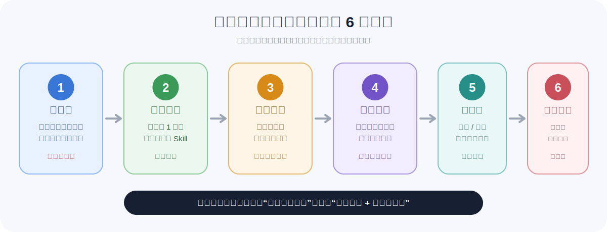
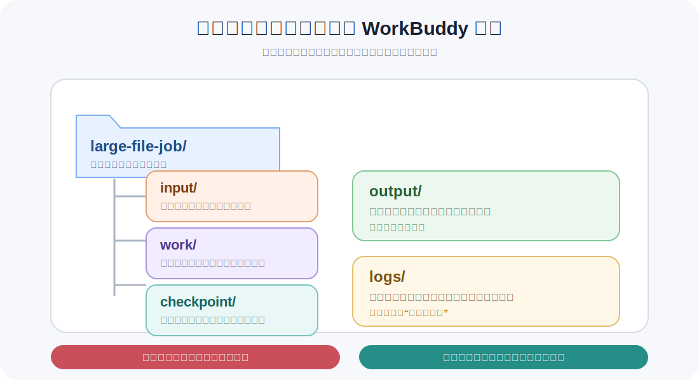
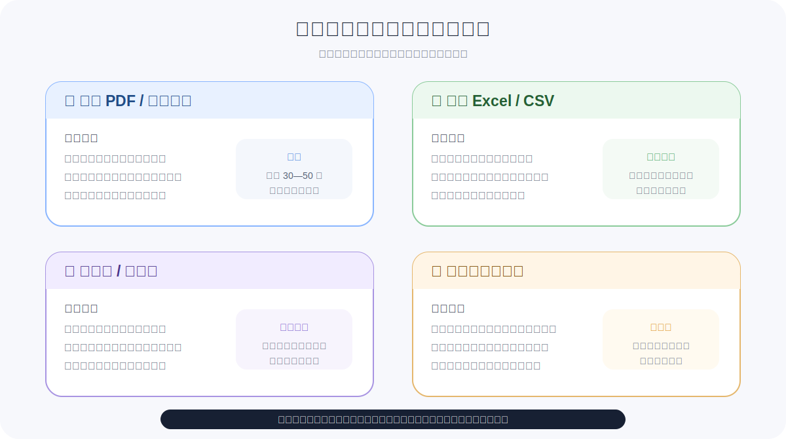
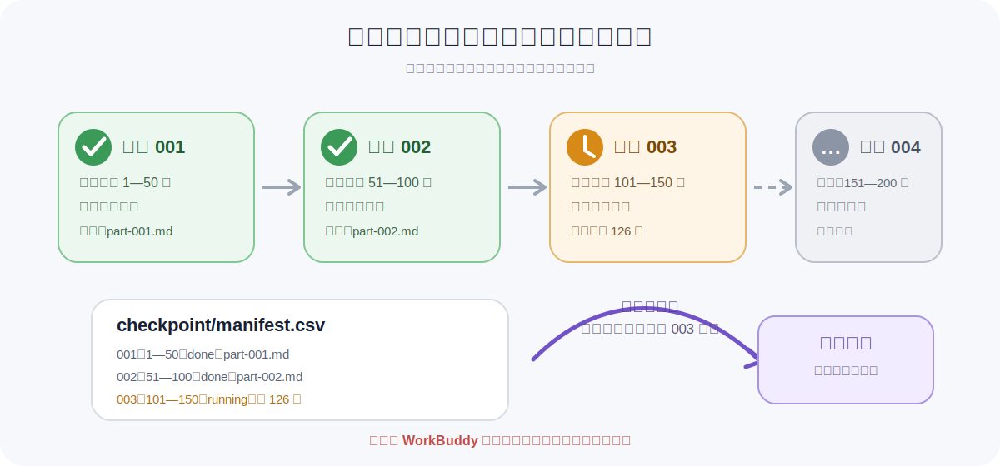

# 用 WorkBuddy 处理本地电脑大文件：分批、分块与断点续跑

> 验证状态：B 级来源核对。本文根据 WorkBuddy 官方文档与官方 FAQ 整理，并结合通用的大文件处理方法编写，尚未完成本项目的完整人工实测。不同模型、Skill、电脑性能和文件格式会影响实际结果，请先用副本和小样测试。

WorkBuddy 支持读取用户授权的本地工作目录，并执行文档、表格、音视频和批量文件处理任务。但处理大文件时，最容易失败的做法就是：

> 把一个几百页 PDF、几百万行 CSV、数小时视频或几万个文件一次性交给 WorkBuddy，然后等待最终结果。

更稳妥的方法是：**先清点、再抽样、先看计划、分批执行、记录进度，最后合并验收。**



## 一、什么情况算“大文件”

WorkBuddy 官方文档没有给出一个统一的“大文件大小”阈值。本文采用更实用的判断方式：

> 只要文件无法稳定地一次读完、一次处理完，或者失败后重新执行成本很高，就应当按“大文件任务”处理。

常见情况包括：

- 数百页以上、图片很多或需要 OCR 的 PDF；
- 打开困难、行数很多或体积很大的 Excel、CSV；
- 几十分钟到数小时的录音、课程、会议或视频；
- 一个目录中有几千到几万个图片、合同、票据或资料；
- 多个大型文件需要合并分析；
- 任务执行时间很长，容易超时、中断或重复处理。

不要只看文件体积。一个 30 MB 的扫描 PDF，可能比一个 300 MB 的纯文本 CSV 更难处理。

## 二、先理解一个重要区别：本地文件不等于完全离线

WorkBuddy 可以读取你授权的电脑文件夹，但任务实际使用的模型、Skill 或第三方连接器，可能需要网络服务。

因此，处理正式资料前要确认：

- 当前使用的是哪个模型；
- 文件内容是否会发送到模型服务；
- Skill 是否调用第三方 API；
- 是否符合公司的数据安全要求；
- 是否包含客户、员工、患者、合同、财务或未公开经营数据。

对于敏感数据，应先脱敏，并使用组织允许的模型和处理方式。不要因为文件位于本地，就默认整个过程一定不会离开电脑。

## 三、处理前准备：不要直接操作唯一一份原文件

### 1. 创建独立工作目录

推荐目录结构如下：



```text
large-file-job/
├── input/          # 原文件副本，只读使用
├── work/           # 分块文件和中间结果
├── checkpoint/     # 批次进度和续跑记录
├── output/         # 最终结果
└── logs/           # 文件清单、错误记录和处理说明
```

### 2. 只放副本

把需要处理的大文件复制到 `input/`，原文件保留在原位置。

任务中明确写：

```text
不得修改、覆盖、移动、重命名或删除 input/ 中的任何文件。
所有中间文件写入 work/，最终结果写入 output/。
```

### 3. 检查磁盘空间

分块、解压、转码和生成中间结果时，可能需要额外空间。开始前检查：

- 原文件大小；
- 当前磁盘剩余空间；
- `work/` 和 `output/` 所在磁盘；
- 是否会生成音频、图片、OCR 文本或多个中间文件。

空间不确定时，先处理一个小样，观察中间文件会增长多少。

### 4. 使用默认权限

官方建议日常任务使用默认权限。大文件任务可能运行脚本、读取多个文件或调用外部程序，更不适合长期开启完全访问。

首次执行建议使用 **Plan（想一想）模式 + 默认权限**，先看处理计划和文件范围，再决定是否继续。

## 四、第一步：只清点，不处理内容

不要一开始就要求“分析全部内容”。先让 WorkBuddy 建立文件清单。

### 可直接复制的指令

```text
请先不要处理文件内容，也不要修改任何文件。

只扫描当前工作目录中的 input/，生成 logs/inventory.csv，字段包括：
1. 文件名；
2. 完整相对路径；
3. 文件类型；
4. 文件大小；
5. 修改时间；
6. 如果可以快速获取，记录 PDF 页数、音视频时长、表格工作表数量或 CSV 大致行数；
7. 是否可以正常打开；
8. 可能需要的模型、Skill 或本地工具；
9. 风险和待确认事项。

不要读取完整内容，不要移动、重命名、删除或覆盖文件。
完成后先给我一份概览，不要开始正式处理。
```

### 你需要检查什么

- WorkBuddy 是否识别了正确文件；
- 是否漏掉了子目录；
- 文件格式和扩展名是否一致；
- 是否存在加密、损坏或无法读取的文件；
- 是否把无关文件也纳入了任务；
- 是否需要安装额外 Skill；
- 是否出现敏感文件。

文件清单不正确时，不要进入下一步。

## 五、第二步：先做小样测试

官方文件处理实践建议先验证小批量样本，再扩大到全量文件。

### 小样怎么选

不要只挑最简单的文件。至少选择：

- 一个正常样本；
- 一个较复杂样本；
- 一个可能失败的边界样本。

例如：

- PDF：普通文字页、表格页、扫描页；
- CSV：开头 1 万行、日期异常区域、包含空值的区域；
- 音视频：开头 5 分钟、多人交谈片段、噪声较大的片段；
- 文件目录：10—20 个不同格式和命名方式的文件。

### 可直接复制的指令

```text
请只做小样测试，不要处理全部文件。

从 logs/inventory.csv 中选择：
- 1 个普通样本；
- 1 个复杂样本；
- 1 个可能失败的样本。

对每个样本测试：
1. 是否可以读取；
2. 是否需要额外 Skill 或本地工具；
3. 处理一小段需要多长时间；
4. 会生成哪些中间文件；
5. 输出是否准确、完整、可打开；
6. 有哪些风险或限制。

结果保存到 logs/sample-test.md。
不要修改 input/ 中的文件，不要继续处理全部数据。
```

小样失败时，先解决模型、Skill、格式、OCR、编码或权限问题，不要用全量文件继续试错。

## 六、第三步：让 WorkBuddy 先生成分批计划



### 通用计划指令

```text
请根据 logs/inventory.csv 和 logs/sample-test.md，制定大文件分批处理计划。
现在只输出计划，不要执行。

计划必须包含：
1. 文件如何拆分；
2. 每批处理范围；
3. 每批输入和输出文件名；
4. 预计使用的模型、Skill 或本地工具；
5. 每完成一批如何验证；
6. 如何记录进度；
7. 失败后从哪里继续；
8. 如何合并最终结果；
9. 哪些步骤需要我确认；
10. 哪些操作可能修改、删除、覆盖、联网或产生较大临时文件。

请将计划保存到 logs/processing-plan.md。
```

计划中如果出现“一次读取全部文件”“直接覆盖原文件”或“处理完成后自动删除中间结果”，应要求改成更安全的方式。

## 七、第四步：根据文件类型分批处理

### 场景 A：大型 PDF 或扫描文档

推荐顺序：

1. 读取目录和页数；
2. 判断哪些页面有可提取文字；
3. 对扫描页单独做 OCR 测试；
4. 按章节或页码分批；
5. 每批生成局部结果；
6. 最后合并并抽查页码。

#### 可复制指令

```text
请处理 input/report.pdf，但不要一次读取和总结全部内容。

第一阶段：
1. 获取总页数和目录结构；
2. 检查哪些页面是文字、表格、图片或扫描页；
3. 把处理计划保存到 logs/pdf-plan.md；
4. 先不要正式处理。

我确认后，每批处理 30—50 页，并执行：
- 提取标题、关键观点、数据、方法和限制；
- 重要结论标注原始页码；
- 无法识别的内容写入 failed-pages.csv；
- 每批输出到 work/pdf-parts/part-001.md、part-002.md……；
- 完成后更新 checkpoint/manifest.csv；
- 不要修改原 PDF。
```

`30—50 页` 只是起点。图片多、表格多或 OCR 困难时应减少每批页数。

### 场景 B：大型 Excel 或 CSV

大表格最常见的问题是内存不足、处理时间过长、类型识别错误和重复处理。

推荐顺序：

1. 只读取字段、工作表、编码和少量样本；
2. 统计行数，但不要一次性加载全部内容；
3. 按行数、日期、地区或业务字段分区；
4. 每批输出统计和异常清单；
5. 最后统一汇总。

#### 可复制指令

```text
请处理 input/sales.csv。

安全要求：
- 不要一次性把整个文件读入内存；
- 不要修改原文件；
- 如果需要运行本地脚本，先向我展示脚本用途、输入、输出和影响范围；
- 所有中间结果写入 work/csv-parts/。

第一步只执行：
1. 检查编码、分隔符和字段名；
2. 读取前 100 行和随机 100 行；
3. 统计总行数；
4. 识别日期、数字、空值和异常字段；
5. 建议按什么字段或行数分批；
6. 把计划保存到 logs/csv-plan.md。

不要开始全量处理。
```

确认计划后：

```text
按已确认的计划逐批处理 sales.csv。

每批要求：
1. 读取固定范围的数据；
2. 检查空值、重复项和格式异常；
3. 输出该批统计结果和异常清单；
4. 记录批次范围、状态和输出路径；
5. 一批完成并通过检查后，再开始下一批；
6. 已完成批次不得重复处理。
```

### 场景 C：长音频或大视频

推荐顺序：

1. 获取时长、编码、分辨率和现有字幕；
2. 先测试一小段；
3. 按固定时长或自然章节切段；
4. 逐段转写、翻译或摘要；
5. 保留时间戳；
6. 合并时处理段落重叠和重复内容。

#### 可复制指令

```text
请处理 input/interview.mp4，但现在不要直接转写全部视频。

先执行：
1. 获取视频时长、编码、音轨和字幕信息；
2. 测试前 5 分钟是否可以正常提取声音和转写；
3. 说明文件内容是否会发送到第三方模型或服务；
4. 建议切段时长和重叠长度；
5. 把计划保存到 logs/video-plan.md。

我确认后，再按批次处理：
- 每段保留开始和结束时间戳；
- 每段输出原文、中文翻译和摘要；
- 输出到 work/transcripts/segment-001.md……；
- 失败片段记录到 checkpoint/failed-segments.csv；
- 不要修改原视频。
```

### 场景 D：成千上万个本地文件

不要直接让 WorkBuddy “整理整个桌面”或“一次性重命名全部文件”。先生成清单和预览。

#### 可复制指令

```text
请处理 input/files/ 中的大量文件，但现在只建立清单，不移动、不重命名、不删除。

生成 logs/files-inventory.csv，字段包括：
- 原路径；
- 文件名；
- 扩展名；
- 大小；
- 修改时间；
- 建议分类；
- 建议新名称；
- 判断依据；
- 风险；
- 是否需要人工确认。

随后按扩展名、日期或目录分组，每组最多处理 100 个文件。
第一组只生成预览，等我确认后再执行。
必须保存原路径与新路径映射，以便恢复。
```

## 八、第五步：记录进度，支持断点续跑

长任务最重要的不是“永远不中断”，而是“中断后知道从哪里继续”。



建议建立：

```text
checkpoint/manifest.csv
```

字段至少包含：

```text
batch_id
input_file
input_range
status
output_file
started_at
completed_at
error
verified
```

### 每批执行时的固定要求

```text
每完成一个批次，立即更新 checkpoint/manifest.csv。

状态只允许：
- pending
- running
- done
- failed
- needs-review

开始下一批前，先确认上一批状态为 done 或 needs-review。
不得重复处理 done 状态的批次。
```

### 中断后的续跑指令

```text
请读取 checkpoint/manifest.csv，恢复上次的大文件任务。

要求：
1. 跳过所有 status=done 的批次；
2. 检查 status=running 的批次是否留下完整输出；
3. 不完整时从该批次重新开始；
4. 先处理 failed 和 needs-review；
5. 不要重新扫描和重做已确认完成的内容；
6. 继续前先告诉我将从哪个批次开始。
```

## 九、第六步：合并和验收

分批完成后，不要直接把所有局部结果简单拼接。合并时要处理：

- 重复内容；
- 批次边界遗漏；
- 前后术语不一致；
- 页码或时间戳错误；
- 局部统计与总计不一致；
- 失败批次未补齐；
- 输出文件打不开。

### 合并指令

```text
请根据 checkpoint/manifest.csv 合并所有 status=done 的批次结果。

要求：
1. 先检查是否存在 pending、failed 或 needs-review；
2. 如果存在，不要生成“最终完成”结论，只列出缺失项；
3. 按原始顺序合并；
4. 删除重复内容，但保留页码、时间戳或批次来源；
5. 统一标题、术语、字段和格式；
6. 生成 output/final-result.md；
7. 同时生成 output/validation-report.md，记录：
   - 完成批次数；
   - 失败批次数；
   - 抽查范围；
   - 数字和引用核对结果；
   - 尚未确认的内容；
8. 不要删除任何中间文件。
```

## 十、一个可以直接使用的“一条龙”计划指令

第一次运行时建议选择 Plan 模式：

```text
我要处理当前工作目录 input/ 中的大文件。

请先只制定计划，不要立即执行。

必须遵守：
1. 不修改、覆盖、移动、重命名或删除 input/ 中的文件；
2. 先生成 logs/inventory.csv；
3. 先选择小样测试；
4. 根据文件类型制定分块和分批方案；
5. 所有中间文件写入 work/；
6. 所有进度写入 checkpoint/manifest.csv；
7. 每完成一批先验证，再开始下一批；
8. 任务中断后支持从未完成批次继续；
9. 最终结果写入 output/；
10. 涉及联网、运行脚本、安装工具、删除、覆盖或访问工作目录外路径时，必须先说明并等待我确认；
11. 说明模型、Skill 或第三方服务是否可能接触文件内容；
12. 先把完整处理计划保存为 logs/processing-plan.md，等我确认后再开始。
```

## 十一、最常见的失败原因

### 1. 一次性要求处理全部内容

结果可能是超时、内存不足、输出截断或任务中断。应改成“清点 → 小样 → 分批”。

### 2. 没有指定工作目录

WorkBuddy 可能在默认目录生成结果，用户随后找不到文件。应明确 `input/`、`work/`、`output/` 和 `checkpoint/`。

### 3. 直接处理唯一一份原文件

批量转换、重命名或清洗可能难以恢复。应只处理副本。

### 4. 长期开启完全访问

大文件任务常涉及脚本和批量文件操作，路径一旦错误，影响范围会很大。日常保持默认权限。

### 5. 没有进度清单

任务失败后只能从头开始，既浪费时间，也可能重复生成结果。必须维护 `manifest.csv`。

### 6. 每次重试都重新处理全部数据

应读取检查点，只恢复失败或未完成的批次。

### 7. 没有验证中间结果

错误可能在几十个批次后才被发现。每批至少检查文件可打开、范围正确、数字可抽查。

### 8. 把“本地文件”误认为“完全离线”

模型和 Skill 的数据流需要单独确认，尤其是敏感资料。

## 十二、哪些情况不建议直接交给 WorkBuddy

以下任务应先由专业人员确认，或在隔离环境中处理：

- 磁盘已经出现损坏迹象；
- 文件只有唯一一份且没有备份；
- 加密文件、密码库或密钥文件；
- 生产数据库和线上业务目录；
- 未脱敏的医疗、财务、法律或客户资料；
- 涉及批量删除、覆盖和不可逆转换；
- 你无法判断脚本、第三方工具或 Skill 的行为；
- 任务结果将直接用于重大决策，但没有人工复核。

## 十三、最终检查清单

开始前：

- [ ] 原文件已有备份；
- [ ] 使用独立工作目录；
- [ ] 磁盘空间充足；
- [ ] 使用默认权限；
- [ ] 已确认模型、Skill 和数据去向；
- [ ] 已建立文件清单；
- [ ] 已完成小样测试。

执行中：

- [ ] 每批范围清楚；
- [ ] 每批结果可打开；
- [ ] 已更新检查点；
- [ ] 已完成批次不会重复处理；
- [ ] 失败原因有记录；
- [ ] 没有修改原文件。

完成后：

- [ ] 没有遗漏失败批次；
- [ ] 最终结果按原顺序合并；
- [ ] 页码、时间戳和数字经过抽查；
- [ ] 生成了验证报告；
- [ ] 中间文件暂时保留；
- [ ] 正式交付物已复制到独立保存位置。

## 参考资料

- [Tencent WorkBuddy 中文简介](https://www.workbuddy.ai/docs/zh/)
- [新建任务栏：工作模式、目录、模型与权限](https://www.workbuddy.ai/docs/zh/workbuddy/From-Beginner-to-Expert-Guide/Function-Description/Task-Bar)
- [实践一：文件内容识别与处理](https://www.workbuddy.ai/docs/zh/workbuddy/From-Beginner-to-Expert-Guide/Practice-Cases/File-Recognition)
- [WorkBuddy 中文常见问题](https://www.workbuddy.ai/docs/zh/workbuddy/From-Beginner-to-Expert-Guide/FQA)
- [Create Task](https://www.workbuddy.ai/docs/workbuddy/Create-Task)
- [Tips & Tricks](https://www.workbuddy.ai/docs/workbuddy/From-Beginner-to-Expert-Guide/Efficient-Tips)
- [Permission Modes](https://www.workbuddy.ai/docs/workbuddy/From-Beginner-to-Expert-Guide/Function-Description/Permission-Modes)

## 更新记录

- 2026-07-17：创建本地大文件分批、分块、检查点与断点续跑完整教程，并加入三张中文示意图。
