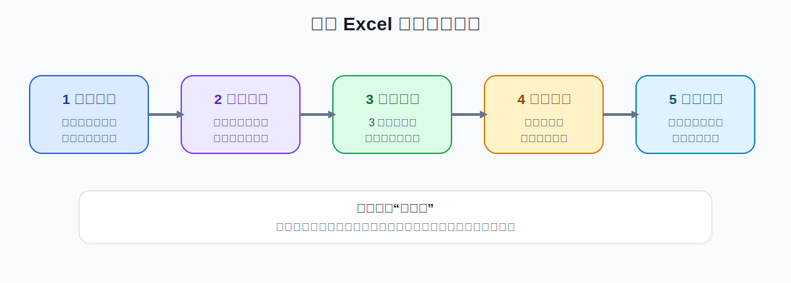
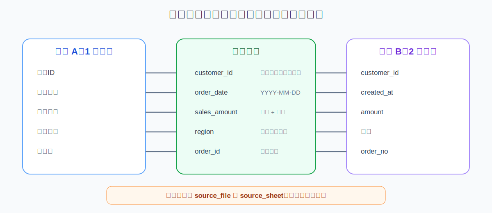

# 用 WorkBuddy 合并多份 Excel：字段对齐、去重与自动汇总

> 验证状态：B 级来源核对。本文依据 WorkBuddy 官方数据分析能力、Excel 官方合并原则和公开实战案例整理，尚未完成本项目的完整人工实测。不同文件结构、数据量和模型会影响实际结果。

多表合并最容易出错的地方不是“复制慢”，而是：

- 表头看起来相同，实际含义不同；
- 同一字段在不同文件里叫法不同；
- 日期、金额和百分比被当成文本；
- 重复订单被重复计算；
- 合并后无法追溯数据来自哪个文件；
- 某个文件失败，却仍然生成“已完成”的报表。

正确流程是：**先清点文件和字段，再建立映射规则，做小样合并，最后全量处理和复算。**



## 适合什么场景

- 12 个月销售明细合并；
- 多门店、多分公司或多渠道报表汇总；
- 不同业务系统导出的订单数据整合；
- 多个问卷或活动报名表合并；
- 多个招聘渠道候选人数据汇总；
- 多个项目工时、预算或库存表合并。

## 完成后应该得到什么

```text
output/
├── merged-data.xlsx          # 合并后的明细
├── summary-report.xlsx       # 汇总指标和图表
├── field-mapping.xlsx        # 字段映射表
├── exception-report.xlsx     # 失败文件、异常行和重复项
└── validation-report.md      # 复算和验收记录
```

## 开始前准备

```text
merge-excel-job/
├── input/          # 原始 Excel 副本
├── sample/         # 小样结果
├── output/         # 最终结果
├── logs/           # 文件清单和异常记录
└── backup/         # 必要备份
```

不要直接在原始月报目录里执行。先复制 3—5 个代表性文件做样本。

## 第一步：建立文件与字段清单

```text
请只检查 input/ 中的 Excel 文件，不要合并，也不要修改原文件。

生成 logs/excel-inventory.xlsx，记录：
1. 文件名和工作表名称；
2. 行数、列数和表头；
3. 每列的数据类型；
4. 日期、金额、百分比和 ID 字段；
5. 是否存在空行、合并单元格、隐藏行列和公式；
6. 表头是否重复或缺失；
7. 文件是否可以正常打开；
8. 建议的主键和去重字段；
9. 待人工确认事项。

现在只生成清单，不要开始合并。
```

**成功标志：** 所有文件都在清单中，且你能看出表头差异。

## 第二步：建立字段映射



不同文件可能使用：

```text
客户ID / customer_id / 用户编号
成交金额 / 销售额 / amount
下单日期 / 订单时间 / created_at
```

先生成映射，不要让 WorkBuddy 靠猜测直接合并：

```text
请根据 excel-inventory.xlsx 生成 output/field-mapping.xlsx。

字段包括：
- 标准字段名；
- 每个文件中的原字段名；
- 标准数据类型；
- 转换规则；
- 缺失时如何处理；
- 是否参与去重；
- 是否参与汇总；
- 风险和人工确认状态。

不要把含义不确定的列自动合并。
```

## 第三步：确定去重规则

常见主键：订单号、客户 ID、手机号、项目编号、日期加商品编号。

```text
请先生成去重预览，不要删除任何行。

规则：
1. 优先使用已确认的唯一主键；
2. 主键相同但其他字段不同，标记为“冲突重复”；
3. 完全相同的行标记为“完全重复”；
4. 主键缺失的行单独列出；
5. 输出 sample/dedup-preview.xlsx；
6. 等我确认后再执行去重。
```

不要只按姓名或商品名称去重，因为同名并不代表同一条记录。

## 第四步：小样合并

选择三个有代表性的文件：结构标准、字段有差异、含异常数据。

```text
请只合并我指定的 3 个样本文件，输出 sample/merged-sample.xlsx。

要求：
1. 按 field-mapping.xlsx 对齐字段；
2. 新增 source_file 和 source_sheet 两列；
3. 不修改原文件；
4. 不删除未确认的重复项；
5. 日期统一为 YYYY-MM-DD；
6. 金额转为数值并保留原币种；
7. 缺失字段填空，不使用“0”冒充；
8. 无法转换的行写入 sample/sample-exceptions.xlsx；
9. 输出合并前后行数对账表。
```

## 第五步：全量合并

小样通过后再执行：

```text
请根据已确认的 field-mapping.xlsx 和去重规则，合并 input/ 中全部 Excel 文件。

输出：
- output/merged-data.xlsx；
- output/exception-report.xlsx；
- logs/merge-manifest.csv。

必须做到：
1. 每处理一个文件就记录状态；
2. 保留 source_file 和 source_sheet；
3. 任何失败文件都不能静默跳过；
4. 不覆盖已存在结果，使用版本号；
5. 合并后记录总文件数、成功数、失败数、总行数和重复行数；
6. 不修改 input/ 中的文件。
```

## 第六步：生成汇总报表

```text
请基于 output/merged-data.xlsx 生成 output/summary-report.xlsx。

要求：
1. 先写清楚指标口径；
2. 按月份、区域、产品和渠道汇总；
3. 图表标明标题、单位、时间范围和数据来源；
4. 异常和缺失数据单独展示；
5. 不把缺失值自动当成 0；
6. 生成一页“数据质量”工作表；
7. 所有汇总指标能够从明细抽样复算。
```

## 一条可以直接复制的完整指令

```text
请合并当前工作目录 input/ 中的全部 Excel 文件。

先不要直接执行，请按以下流程：
1. 生成文件和字段清单；
2. 建立字段映射表，含义不确定的列标记待确认；
3. 生成去重预览，不立即删除数据；
4. 用 3 个样本文件做小样合并；
5. 我确认后再全量合并；
6. 按列名和字段含义对齐，不按列位置拼接；
7. 新增 source_file 和 source_sheet 两列；
8. 日期、金额和百分比统一格式；
9. 失败文件、异常行和冲突重复单独输出；
10. 生成合并前后行数对账；
11. 输出 merged-data.xlsx、summary-report.xlsx、exception-report.xlsx 和 validation-report.md；
12. 不修改或覆盖 input/ 中的任何文件。
```

## 怎么判断成功

- 文件总数与清单一致；
- 每个输入文件都有成功或失败状态；
- 合并后的行数能与输入、重复和异常数量对账；
- 字段含义一致，不是只按位置拼接；
- 日期、金额、百分比和 ID 格式正确；
- 每行可以追溯到来源文件；
- 汇总指标能抽样复算；
- 异常和缺失没有被隐藏；
- 原始文件保持不变。

## 常见问题

### 表头顺序不同

按列名和字段映射合并，禁止按列位置直接拼接。

### 同一字段名称不同

人工确认标准字段名，并在映射表中记录，不要让模型自行猜测。

### 文件中有多个工作表

先确认哪些工作表是明细、汇总或说明页，避免把汇总表再次作为明细合并。

### 日期变成数字或乱码

记录源格式和目标格式；先在小样中测试时区、文本日期和 Excel 序列日期。

### 合并后总金额不一致

检查重复订单、币种、退款负数、文本金额和汇总表重复纳入。

### 文件数量多、任务卡住

分批处理，每批 5—20 个文件，并维护 `merge-manifest.csv`。

## 撤销与恢复

- 所有输入只用副本；
- 字段映射和去重规则单独保存；
- 每次输出使用版本号；
- 失败后从未完成文件继续；
- 不删除异常报告和来源列；
- 发现错误时回到小样和映射表修正规则。

## 权限、隐私和数据去向

- 客户、订单、薪酬和财务数据应先脱敏；
- 本地文件不等于整个过程完全离线；
- 使用第三方模型或 Skill 前确认数据去向；
- 只授权任务目录；
- 不建议长期使用完全访问；
- 自动报表发送前必须人工确认。

## 参考资料

### 官方资料

- [WorkBuddy 数据分析与可视化](https://www.workbuddy.ai/docs/zh/workbuddy/From-Beginner-to-Expert-Guide/Practice-Cases/Data-Analysis)
- [新建任务栏与工作目录](https://www.workbuddy.ai/docs/zh/workbuddy/From-Beginner-to-Expert-Guide/Function-Description/Task-Bar)
- [Microsoft Excel 合并多个工作表](https://support.microsoft.com/zh-cn/excel/consolidate-data-in-multiple-worksheets)

### 社区教程

- [合并多个 Excel 的 WorkBuddy 案例](https://cloud.tencent.com/developer/article/2680628)
- [WorkBuddy 批量处理表格技巧](https://cloud.tencent.com/developer/article/2669310)

社区案例用于发现真实问题和提示词结构，本文已重新设计字段映射、异常记录和验收流程。

## 更新记录

- 2026-07-17：搜集官方和社区资料，创建 B 级图文教程。