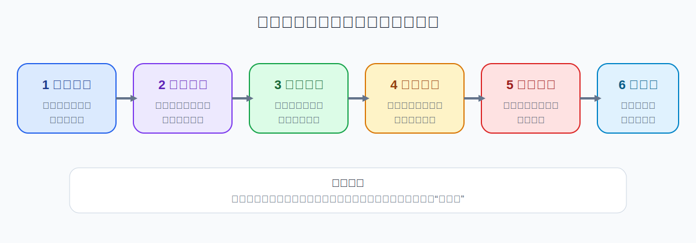
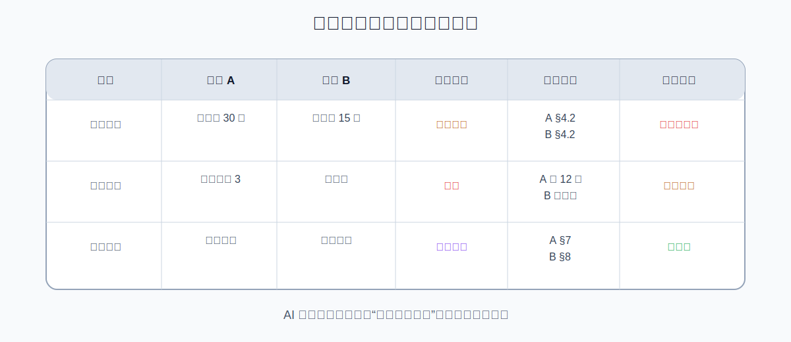

# 用 WorkBuddy 对比多份 Word/PDF：找出差异、遗漏与冲突

> 验证状态：B 级来源核对。本文依据 WorkBuddy 官方文档、公开文档处理案例和 Word 官方比较机制整理，尚未完成本项目的完整人工实测。不同模型、文档格式、扫描质量和文件数量会影响实际结果。

当你手里有多个版本的方案、合同、制度、需求文档或报告时，最危险的不是“看得慢”，而是遗漏被删除的内容、把冲突信息直接合并，或者让 AI 擅自判断哪个版本正确。

更稳妥的流程是：**先建立文件清单，再确定比较维度，逐项提取证据，最后才生成合并建议。**



## 适合什么场景

- 两个或多个 Word 方案版本对比；
- 合同初稿、修订稿和客户回传稿对比；
- 新旧制度、政策或操作手册对比；
- 不同部门提交的汇报材料对比；
- 多家供应商方案横向比较；
- 多篇 PDF 报告中的结论、数字和范围比较。

涉及法律、财务、人事、医疗或合规的最终判断时，WorkBuddy 只能整理证据，不能代替专业人员作决定。

## 完成后应该得到什么

```text
output/
├── document-inventory.csv      # 文件清单和版本关系
├── difference-matrix.xlsx      # 逐项差异矩阵
├── conflicts-and-gaps.md       # 冲突、遗漏和待确认项
└── merge-recommendation.md     # 合并建议，不覆盖原文
```

差异矩阵至少包含：比较维度、各文件内容、差异类型、原始位置、可能影响、建议处理和人工确认状态。

## 开始前准备

### 创建独立工作目录

```text
compare-documents-job/
├── input/          # 所有原文件副本
├── extracted/      # 提取后的文本或章节
├── output/         # 差异表和报告
├── evidence/       # 页码、章节和引用证据
└── logs/           # 清单、失败页和处理记录
```

只把副本放入 `input/`。文件名应能说明版本关系，例如：

```text
01-original.docx
02-internal-review.docx
03-client-revision.docx
04-final-candidate.docx
```

文件名混乱时，先建立清单，不要让 WorkBuddy 猜“哪个是最新版”。

## 第一步：只建立文件清单

选择 **Plan 模式**，输入：

```text
请检查当前工作目录 input/ 中的文档，但现在不要比较正文，也不要修改任何文件。

请生成 logs/document-inventory.csv，字段包括：
1. 文件名、类型和大小；
2. 页数或章节数；
3. 文档标题和日期；
4. 可能的版本关系；
5. 是否可以完整读取；
6. 是否存在扫描页、图片、表格或批注；
7. 待人工确认事项。

无法确认版本关系时标记“待确认”，不要自行判断。
```

**成功标志：** 所有目标文件都出现在清单里，版本顺序由你确认。

## 第二步：确定比较维度

不要直接说“找不同”，先让 WorkBuddy 建立结构化维度：

```text
请根据文件清单和我的目标，生成比较维度。

必须包含：
- 标题和章节结构；
- 新增、删除和改写内容；
- 数字、金额、日期和比例；
- 责任人和责任边界；
- 交付物和验收标准；
- 风险、限制和例外；
- 引用、附件和数据来源；
- 表格、图片和脚注变化。

将维度保存到 logs/comparison-plan.md。
现在只输出计划，不要开始比较。
```

## 第三步：逐份提取结构和证据



大型文档建议逐份、逐章提取：

```text
请先处理 input/01-original.docx。

要求：
1. 提取目录和章节层级；
2. 给每个段落生成稳定编号，例如 A-01、A-02；
3. 保留标题、正文、表格和脚注；
4. 记录原始页码或章节位置；
5. 无法读取的内容写入 logs/failed-sections.csv；
6. 保存到 extracted/01-original-structured.md；
7. 不要总结，不要改写，不要与其他文件比较。
```

然后对其他文件重复执行。这一步的目标是让每个差异都能回到原文。

## 第四步：生成差异矩阵

```text
请比较 extracted/ 中的结构化文档，生成 output/difference-matrix.xlsx。

规则：
1. 按章节和比较维度逐项对齐；
2. 每条差异必须标注来源文件和原始位置；
3. 区分新增、删除、改写、数字变化、范围变化和顺序变化；
4. 含义不确定时标记“需要人工确认”；
5. 不要自行判断哪个版本正确；
6. 保留各版本原文摘要，不要只写你的结论；
7. 对金额、日期、比例、责任人和否定词单独检查；
8. 无法对齐的段落放入“未匹配内容”工作表。
```

推荐差异类型：新增、删除、改写、数字变化、范围变化、冲突和未匹配。

## 第五步：单独检查高风险差异

```text
请从 difference-matrix.xlsx 中筛选高风险差异，生成 output/conflicts-and-gaps.md。

高风险包括：
- 金额、付款、退款和赔偿；
- 日期、期限和自动续期；
- 权利、义务和责任主体；
- 删除、限制、免责和例外；
- 数据、隐私和知识产权；
- 验收标准和交付范围；
- 同一概念在不同章节定义不一致；
- 关键附件缺失。

每条写明差异、各版本原文摘要、位置、可能影响、确认人和状态。
```

## 第六步：生成合并建议，而不是直接覆盖

```text
请基于已确认的差异矩阵，生成 output/merge-recommendation.md。

要求：
1. 只处理人工标记为 approved 的差异；
2. 未确认差异保持并列，不要擅自选择；
3. 说明建议保留、删除或改写的理由；
4. 保留来源文件和位置；
5. 生成建议稿，不要覆盖 input/ 中的任何文件；
6. 列出仍待确认的条目。
```

确认建议后，才生成新的 `merged-draft-v1.docx`。

## 一条可以直接复制的完整指令

```text
我要对比当前工作目录 input/ 中的多份 Word/PDF 文档。

请按以下流程执行：
1. 先生成文件清单，等我确认版本关系；
2. 制定比较维度，不要立即比较；
3. 逐份提取章节、段落编号和原始位置；
4. 生成差异矩阵，区分新增、删除、改写、数字变化、范围变化和冲突；
5. 每条差异保留来源文件和页码/章节；
6. 单独检查金额、日期、比例、责任人、否定词、例外和附件；
7. 无法判断时标记“待确认”，不要替我作决定；
8. 输出 difference-matrix.xlsx、conflicts-and-gaps.md 和 merge-recommendation.md；
9. 不修改或覆盖 input/ 中的任何文件；
10. 涉及法律、财务、人事、隐私和合规时只整理证据，不给出最终结论。
```

## 怎么判断成功

- 所有目标文件都在清单中；
- 版本关系经过人工确认；
- 每条差异能追溯到具体文件和位置；
- 删除和新增内容没有遗漏；
- 数字、日期、责任人和否定词完成单独检查；
- 冲突信息没有被 AI 擅自合并；
- 原文件保持不变；
- 待确认项没有被写成最终结论。

## 常见问题

### 文档结构完全不同

先按主题和章节粗对齐，再在主题内部比较，不要强制按段落序号匹配。

### 扫描 PDF 识别错误

先对 3—5 页做 OCR 小样，建立失败页清单；未经抽查不得进入差异矩阵。

### 表格比较不完整

要求单独导出表格，并按行、列、单位和合并单元格检查。

### WorkBuddy 认为两个版本“基本一致”

要求输出所有数字、日期、否定词和范围词的逐项检查表，不接受只有概括性结论。

### 文件很多、任务卡住

每批只比较 2—3 个文件；以一个基准版本分别比较，再汇总差异。

## 撤销与恢复

- 输入只使用副本；
- 新文件使用 `v1`、`v2` 版本号；
- 不删除 `extracted/` 和差异矩阵；
- 记录合并稿由哪些文件生成；
- 生成正式合并稿前保存人工确认结果；
- 发现错误时回到上一个已确认差异矩阵。

## 权限、隐私和数据去向

- 本地文件不等于整个处理过程完全离线；
- 模型、Skill 或连接器可能接触文件内容；
- 合同、简历、客户资料和内部制度应先脱敏；
- 只授权本次任务目录；
- 不建议长期开启完全访问；
- 最终稿发布、发送或覆盖前必须人工确认。

## 参考资料

### 官方资料

- [WorkBuddy 中文文档导航](https://www.workbuddy.ai/docs/zh/)
- [文档生成与编辑](https://www.workbuddy.ai/docs/zh/workbuddy/From-Beginner-to-Expert-Guide/Practice-Cases/Document-Generation)
- [新建任务栏与工作模式](https://www.workbuddy.ai/docs/zh/workbuddy/From-Beginner-to-Expert-Guide/Function-Description/Task-Bar)
- [Microsoft Word 合并文档修订](https://support.microsoft.com/zh-CN/Word/combine-document-revisions)

### 社区教程

- [WorkBuddy 文档处理公开案例](https://developer.cloud.tencent.cn/article/2667680)——用于发现常见工作流，本文已重新设计并补充安全边界。

## 更新记录

- 2026-07-17：搜集官方和社区资料，创建 B 级图文教程。