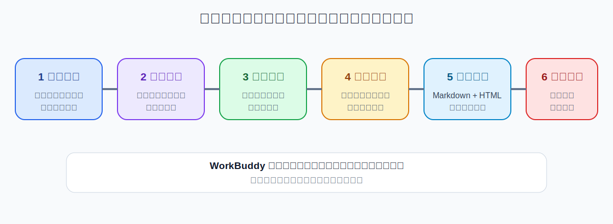
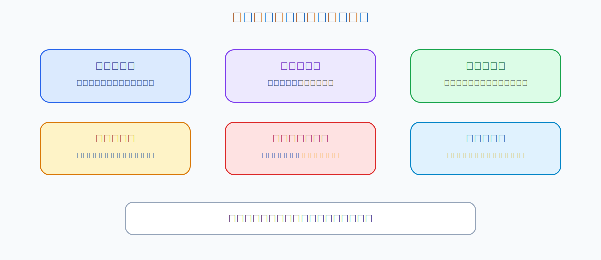

# 用 WorkBuddy 写公众号文章：从资料、选题到排版草稿

> 验证状态：B 级来源核对。本文依据 WorkBuddy 官方自媒体和文档生成能力，以及公开公众号写作、排版案例整理，尚未完成本项目的完整人工实测。公众号后台、平台规则和 WorkBuddy 界面可能变化，发布前必须人工检查。

WorkBuddy 可以帮助整理资料、生成大纲、撰写正文和输出排版文件，但它不应该替你决定：

- 文章是否真实；
- 引用是否准确；
- 标题是否夸张；
- 图片是否有版权；
- 是否符合广告法和平台规则；
- 是否应该现在发布。

最稳妥的做法是：**把“研究、写作、排版、审核、发布”拆开，WorkBuddy 负责机械工作，人负责事实、观点和最终发布。**



## 适合什么场景

- 根据产品资料写功能介绍；
- 把调研报告改成科普文章；
- 把一次真实项目复盘写成案例；
- 把多篇笔记整理成长文；
- 将 Markdown 转成公众号富文本草稿；
- 同一资料生成不同受众版本；
- 建立固定的公众号排版风格。

## 完成后应该得到什么

```text
wechat-article-job/
├── input/                       # 原始资料和引用
├── research/                    # 事实卡片和来源
├── drafts/
│   ├── 01-topic-options.md
│   ├── 02-outline.md
│   ├── 03-first-draft.md
│   └── 04-reviewed-draft.md
├── output/
│   ├── article.md
│   ├── article-richtext.html
│   ├── title-options.md
│   ├── image-brief.md
│   └── fact-check-report.md
└── logs/
    └── change-log.md
```

## 第一步：明确账号、受众和目标

错误指令：

```text
帮我写一篇 WorkBuddy 文章。
```

更好的输入：

```text
账号定位：帮助普通职场人用 AI 提高效率。
目标读者：不懂代码的运营、行政和销售。
文章目标：教读者用 WorkBuddy 合并多份 Excel。
读者看完后应该：知道准备什么、如何操作、如何检查结果。
语气：真实、清楚，不夸张，不制造焦虑。
篇幅：1800—2500 字。
```

如果账号有固定风格，把 2—3 篇你自己的历史文章作为参考，但不要让 WorkBuddy 模仿其他作者的独特表达。

## 第二步：整理事实和来源

```text
请阅读 input/ 中的资料，先建立 research/fact-cards.md，不要开始写文章。

每条事实记录：
1. 事实内容；
2. 原始来源；
3. 发布或更新时间；
4. 是否容易变化；
5. 是否需要再次核对；
6. 能否用于公开文章；
7. 是否包含个人或业务敏感信息。

没有来源或无法确认的内容不要写成事实。
```

对于产品价格、功能、模型、额度和平台规则，发布前重新核对。

## 第三步：生成选题和标题方向

```text
请基于已确认的事实卡片，生成 10 个选题方向。

每个选题包含：
- 目标读者；
- 核心问题；
- 读者收益；
- 可用证据；
- 与已有文章的差异；
- 可能的夸张或误导风险；
- 推荐标题 2 个。

不要使用“震惊”“100%”“彻底取代”“人人月入”等无法证明的表达。
```

选题不是越大越好。一个明确问题通常比“WorkBuddy 全面教程”更容易写清楚。

## 第四步：先确认大纲

```text
请为选中的主题生成大纲，保存到 drafts/02-outline.md。

结构建议：
1. 真实工作问题；
2. 错误做法；
3. 正确流程概览；
4. 准备材料；
5. 分步骤操作；
6. 可复制指令；
7. 结果验收；
8. 常见失败；
9. 隐私和安全提醒；
10. 总结。

每一节标注：要使用的事实、案例和配图。
现在只输出大纲，不写正文。
```

## 第五步：生成初稿

```text
请根据已确认的大纲和 fact-cards.md 写初稿。

要求：
1. 不新增资料中没有的事实；
2. 不虚构用户、收入、时间节省和效果数据；
3. 引用数据保留来源编号；
4. 将操作步骤写给非技术用户；
5. 每个关键步骤写成功标志和失败处理；
6. 使用短段落和明确小标题；
7. 结尾不强行营销；
8. 保存到 drafts/03-first-draft.md。
```

## 第六步：人工观点和事实审核



让 WorkBuddy 生成检查报告：

```text
请审查 drafts/03-first-draft.md，生成 output/fact-check-report.md。

逐项检查：
- 所有数字和事实是否有来源；
- 是否把推断写成事实；
- 是否存在绝对化和夸张表述；
- 是否虚构案例或用户评价；
- 是否引用过长的第三方原文；
- 是否存在广告法、版权或平台风险；
- 是否泄露个人或业务信息；
- 操作步骤是否可能已过期；
- 图片是否需要授权。

不要自动修改有争议的内容，先列出问题和建议。
```

你确认后，再生成 `drafts/04-reviewed-draft.md`。

## 第七步：设计配图

```text
请为文章生成 output/image-brief.md。

每张图说明：
1. 图的目的；
2. 应展示的内容；
3. 推荐类型：真实截图、流程图、目录图、结果示意；
4. 尺寸和横竖比例；
5. 隐私和版权注意事项；
6. 图片插入位置。

禁止伪造 WorkBuddy 界面。
```

P0 教程型文章建议至少包含：流程图、准备目录、关键操作、结果和风险提醒。

## 第八步：生成公众号排版草稿

如果正文使用 Markdown，可以让 WorkBuddy 输出适合复制到公众号编辑器的 HTML：

```text
请将 output/article.md 转换为公众号富文本 HTML，输出 output/article-richtext.html。

排版要求：
1. 保留标题层级、引用、列表、表格和代码块；
2. 正文适合手机阅读；
3. 不使用外部脚本；
4. 图片位置保留明确占位符；
5. 链接文字和来源清晰；
6. 不自动上传或发布；
7. 页面底部提供“复制富文本”按钮时，不得访问无关数据。
```

在公众号后台粘贴后，必须重新检查标题、图片、表格、链接和段落间距。

## 第九步：生成多版本标题和摘要

```text
请生成：
- 10 个公众号标题；
- 3 个 120 字以内摘要；
- 3 个朋友圈分享文案；
- 1 个封面图文案。

要求：
- 不改变文章事实；
- 不夸大结果；
- 标题明确读者、问题或收益；
- 不使用无法证明的数字。
```

## 一条可以直接复制的完整指令

```text
我要根据 input/ 中的资料生成一篇公众号教程文章。

账号定位：【】
目标读者：【】
文章目标：【】
预计篇幅：【】
语气：【】

请按以下流程：
1. 先建立事实卡片和来源，不立即写作；
2. 生成选题和标题方向；
3. 生成大纲，等我确认；
4. 根据确认的大纲写初稿；
5. 不虚构事实、案例、评价、收入和效果数字；
6. 所有数字和产品信息保留来源；
7. 为非技术用户写清准备、步骤、成功标志和失败处理；
8. 生成事实核查和风险报告；
9. 我确认后再生成最终 Markdown 和公众号富文本 HTML；
10. 只生成草稿，不自动上传或发布。
```

## 怎么判断成功

- 文章目标和目标读者明确；
- 每个重要事实可以追溯；
- 没有虚构案例和效果数字；
- 观点与事实区分清楚；
- 操作步骤对非技术用户可理解；
- 图片有用途、来源和隐私检查；
- HTML 粘贴到公众号后台后格式正常；
- 发布动作仍由人工完成。

## 常见问题

### 文章看起来像通用 AI 文案

补充真实背景、你的判断、失败过程和具体操作结果；不要只让模型润色。

### 标题很夸张

要求标题只表达文章能真实提供的帮助，并删除绝对化、恐吓和收入承诺。

### 引用和数据找不到来源

删除或降级为待确认，不允许“看起来合理”就保留。

### 排版复制后错乱

先用短测试文章验证标题、引用、代码块、表格和图片；复杂样式减少使用。

### WorkBuddy 自动建议发布

明确写“只生成草稿，不登录后台、不上传、不发布”。

## 撤销与恢复

- 保存每一版草稿；
- 事实卡片和来源独立保存；
- 排版样式单独做成模板；
- 不覆盖已经发布的文章原稿；
- 修改事实时同步更新核查报告；
- 误粘贴到后台时先保存草稿，不立即群发。

## 权限、隐私和版权

- 内部数据、客户案例和聊天记录应先脱敏；
- 第三方文章只能短引用并注明来源；
- 图片、字体、视频和音乐确认授权；
- 不自动登录、上传或发布；
- 产品功能和价格发布前重新核对；
- 医疗、金融、法律和投资内容应由专业人员审核。

## 参考资料

### 官方资料

- [WorkBuddy 自媒体运营](https://www.workbuddy.ai/docs/zh/workbuddy/From-Beginner-to-Expert-Guide/Practice-Cases/Social-Media)
- [WorkBuddy 文档生成与编辑](https://www.workbuddy.ai/docs/zh/workbuddy/From-Beginner-to-Expert-Guide/Practice-Cases/Document-Generation)

### 社区教程

- [公众号文章从选题到排版案例](https://cloud.tencent.com/developer/article/2693755)
- [Markdown 转微信公众号排版模板](https://cloud.tencent.com/developer/article/2701349)
- [WorkBuddy 自媒体写作公开指南](https://cloud.tencent.com/developer/article/2673025)

社区教程用于了解常见流程和排版方式，本文重新设计了事实卡片、审核闸门和人工发布边界。

## 更新记录

- 2026-07-17：搜集官方和社区资料，创建 B 级图文教程。