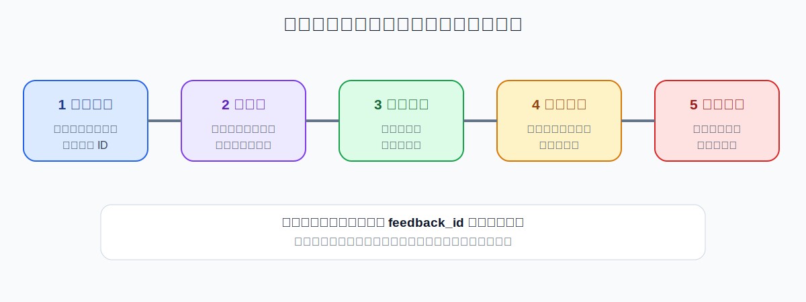
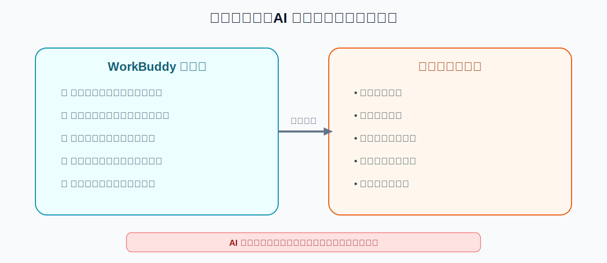

# 用 WorkBuddy 把用户反馈整理成产品需求：保留原话、证据和优先级边界

> 验证状态：B 级来源核对。本文依据 WorkBuddy 官方文档、数据分析能力和公开客户反馈处理案例整理，尚未完成本项目的完整人工实测。AI 可以整理和提出需求候选，但不能替代产品负责人决定优先级和承诺排期。

“帮我总结一下这些反馈”通常只能得到一段漂亮但不可执行的文字。真正能推动工作的结果应该包含：

- 问题分类；
- 客户原话证据；
- 出现频次和影响范围；
- 需求候选；
- 反例和不确定性；
- 后续验证动作；
- 负责人和状态。

核心原则是：**从原始反馈到需求候选必须有完整证据链。**



## 适合什么场景

- 客服工单批量整理；
- 销售从客户微信中汇总的反馈；
- 用户群和评论区问题归类；
- 访谈记录提炼；
- 内测群建议整理；
- App 商店或社区评论分析；
- 版本发布后的问题复盘；
- 将分散反馈整理成产品评审材料。

## 完成后应该得到什么

```text
feedback-analysis-job/
├── input/                       # 原始反馈副本
├── normalized/                  # 去重和标准化后的反馈
├── output/
│   ├── feedback-master.xlsx
│   ├── issue-clusters.xlsx
│   ├── requirement-candidates.xlsx
│   ├── validation-plan.md
│   └── review-brief.md
└── logs/
    ├── duplicates.csv
    ├── uncertain-items.csv
    └── redaction-report.md
```

## 第一步：整理输入并脱敏

不同来源可能包含姓名、手机号、公司、订单号和聊天截图。先脱敏，再交给 WorkBuddy。

```text
请只检查 input/ 中的反馈文件，生成 logs/input-inventory.csv。

记录：
1. 来源文件；
2. 反馈数量；
3. 日期范围；
4. 渠道；
5. 是否包含个人信息；
6. 是否需要脱敏；
7. 是否存在重复、截图或无法读取内容；
8. 待人工确认事项。

不要开始分析，不要修改原文件。
```

脱敏后仍保留一个匿名来源 ID，例如 `customer-017`、`ticket-2031`，方便追溯。

## 第二步：标准化每条反馈

```text
请将反馈整理到 normalized/feedback-normalized.xlsx。

每条记录包含：
- feedback_id；
- source_channel；
- source_date；
- anonymous_user_id；
- original_quote；
- context；
- product_area；
- user_goal；
- observed_problem；
- impact；
- workaround；
- sentiment；
- confidence；
- source_file；
- original_location。

不要改写 original_quote；无法确认的字段留空并标记待确认。
```

“客户想要导出”与“客户导出后格式错乱”不是同一个问题，必须保留上下文。

## 第三步：去重但不丢证据

```text
请生成 logs/duplicates.csv，不要直接删除反馈。

区分：
1. 完全重复；
2. 同一用户重复反馈；
3. 不同用户描述同一问题；
4. 表面相似但场景不同；
5. 无法判断。

合并同类问题时，保留所有 feedback_id 和代表性原话。
```

去重的目标是减少统计偏差，不是把不同用户声音压缩成一句话。

## 第四步：建立问题主题和证据

```text
请根据标准化反馈生成 output/issue-clusters.xlsx。

每个问题主题包含：
- issue_id；
- 问题名称；
- 用户目标；
- 具体阻碍；
- 代表性原话；
- 关联 feedback_id；
- 独立用户数；
- 反馈总数；
- 渠道分布；
- 首次和最近出现日期；
- 影响范围；
- 当前绕过方式；
- 反例；
- 证据强度；
- 待确认事项。
```

不要只按情绪分类。产品团队需要知道用户在什么任务、什么环节遇到什么阻碍。

## 第五步：从问题转成需求候选



```text
请基于 issue-clusters.xlsx 生成 output/requirement-candidates.xlsx。

每个候选需求包括：
1. requirement_id；
2. 对应 issue_id；
3. 用户问题；
4. 目标用户；
5. 期望结果；
6. 需求候选描述；
7. 非目标；
8. 证据和代表性原话；
9. 受影响用户数；
10. 当前绕过方式；
11. 风险和依赖；
12. 需要验证的假设；
13. 建议验证方法；
14. AI 建议，不作为最终优先级。

不要直接承诺功能方案和上线日期。
```

同一个问题可能有多个解决方案。不要把用户提出的具体功能直接当成唯一需求。

例如：

```text
用户说：“希望增加批量导出按钮。”
潜在问题：逐条导出耗时，无法完成月末汇总。
需求候选：支持高效批量获取已筛选数据。
可能方案：批量导出、异步任务、API、定时报表。
```

## 第六步：辅助优先级评审

AI 可以整理评分依据，但最终权重由团队决定。

```text
请为每个需求候选整理优先级参考，不要直接给最终排期。

维度包括：
- 用户价值；
- 独立用户数量；
- 发生频率；
- 业务影响；
- 客户风险；
- 是否有绕过方式；
- 战略匹配；
- 实现成本；
- 技术和合规风险；
- 依赖；
- 证据强度。

对证据不足的需求标记“先验证”，不要因为声音大就排高优先级。
```

## 第七步：生成验证计划

```text
请生成 output/validation-plan.md。

对每个高价值但不确定的需求，说明：
1. 要验证的假设；
2. 目标用户；
3. 需要补充的数据；
4. 访谈或问卷问题；
5. 可做的小实验或原型；
6. 成功和失败标准；
7. 预计负责人；
8. 截止时间由人工填写。
```

## 第八步：生成产品评审简报

```text
请生成 output/review-brief.md。

结构：
- 本期反馈范围；
- 新增高频问题；
- 高风险客户问题；
- 问题主题和证据；
- 需求候选；
- 待验证假设；
- 需要负责人拍板的事项；
- 暂不处理及原因；
- 数据限制。
```

## 一条可以直接复制的完整指令

```text
请把 input/ 中的客户反馈整理成可用于产品评审的需求候选。

流程：
1. 先清点来源并检查隐私；
2. 标准化每条反馈，保留 original_quote、source_file 和 original_location；
3. 生成重复预览，不直接删除；
4. 按用户目标、问题、场景和影响建立问题主题；
5. 每个主题保留 feedback_id、独立用户数、代表性原话和反例；
6. 从问题生成需求候选，明确非目标、风险、依赖和待验证假设；
7. AI 只整理优先级依据，不决定最终优先级和排期；
8. 输出 feedback-master.xlsx、issue-clusters.xlsx、requirement-candidates.xlsx、validation-plan.md 和 review-brief.md；
9. 不回复客户、不承诺功能、不自动创建正式排期；
10. 不修改 input/ 中的原文件。
```

## 怎么判断成功

- 每个需求候选能追溯到原始反馈；
- 原话没有被改写成模型想象；
- 重复反馈没有被重复计数；
- 独立用户数与反馈总数分开；
- 用户问题与用户建议的功能分开；
- 反例和证据不足被保留；
- AI 没有直接决定优先级和排期；
- 客户信息经过脱敏；
- 输出可以直接用于评审会议。

## 常见问题

### 分类过于宽泛

要求按用户目标、使用场景和具体阻碍拆分，不要只分“功能、体验、性能”。

### 模型合并了不同问题

检查代表性原话和上下文，将不同用户目标拆开。

### 高频不等于高价值

同时看影响、业务风险、绕过方式和证据强度。

### 用户建议被直接写成需求

先还原背后的任务和问题，再生成多个解决方案候选。

### 情绪分析失真

情绪只作辅助，不用于判断需求优先级；保留原话和人工抽查。

## 撤销与恢复

- 原始反馈只读保存；
- 标准化、聚类和需求候选分成不同文件；
- 每次规则变化使用新版本；
- 不删除重复预览；
- 发现误分类时回到 normalized 数据重跑；
- 评审结论单独记录，不覆盖原始证据。

## 权限、隐私和边界

- 姓名、电话、邮箱、公司、订单和聊天记录应脱敏；
- 不将原始客户反馈上传到不允许的第三方服务；
- 本地文件不等于整个过程完全离线；
- 不自动回复客户或承诺功能；
- 产品负责人决定优先级、方案和排期；
- 涉及安全、支付、隐私和合规的问题应单独升级处理。

## 参考资料

### 官方资料

- [WorkBuddy 中文文档导航](https://www.workbuddy.ai/docs/zh/)
- [WorkBuddy 数据分析与可视化](https://www.workbuddy.ai/docs/zh/workbuddy/From-Beginner-to-Expert-Guide/Practice-Cases/Data-Analysis)

### 社区教程

- [将客户反馈整理成产品改进清单](https://cloud.tencent.com/developer/article/2706877)
- [客户反馈闭环工作流案例](https://cloud.tencent.com/developer/article/2702855)
- [如何向 WorkBuddy 提供有效反馈](https://cloud.tencent.com/developer/article/2669558)

社区教程用于发现工作流和真实问题，本文重新设计了证据链、需求候选和优先级边界。

## 更新记录

- 2026-07-17：搜集官方和社区资料，创建 B 级图文教程。