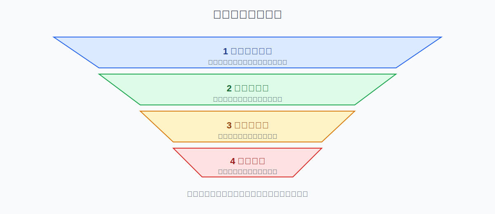
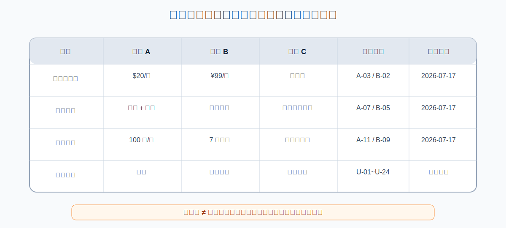

# 用 WorkBuddy 做竞品调研：从资料搜集到可追溯决策报告

> 验证状态：B 级来源核对。本文依据 WorkBuddy 官方“深度研究、报告生成”能力和多篇公开竞品调研案例整理，尚未完成本项目的完整人工实测。价格、功能、套餐和市场信息变化很快，必须记录核对日期。

竞品调研最常见的失败不是资料少，而是资料很多却无法回答决策问题：

- 官网、媒体和用户评论混在一起；
- 价格没有记录币种、计费周期和核对日期；
- 功能只看营销文案，没有区分是否真实可用；
- 把用户抱怨当成普遍事实；
- AI 根据少量资料直接推断市场结论；
- 最终报告没有原始链接，无法复查。

这套流程的核心是：**先定义决策问题，再建立来源证据库，最后做对比和推断。**



## 适合什么场景

- 新产品立项前了解竞品；
- 定价、套餐和免费额度比较；
- 功能路线图和差异化机会分析；
- 市场运营和内容策略对比；
- 供应商或 SaaS 采购对比；
- 向领导或投资人准备竞品报告；
- 定期监控竞品价格、功能和版本变化。

## 完成后应该得到什么

```text
competitor-research-job/
├── input/                    # 你的产品资料和调研目标
├── sources/                  # 来源卡片和网页摘录
├── evidence/                 # 事实、引用和截图说明
├── output/
│   ├── competitor-matrix.xlsx
│   ├── evidence-table.xlsx
│   ├── research-report.md
│   ├── opportunity-map.md
│   └── executive-summary.md
└── logs/
    ├── source-inventory.csv
    ├── conflicts.md
    └── failed-pages.csv
```

## 第一步：先定义调研目标

错误目标：

```text
帮我调研一下这几个竞品。
```

更好的目标：

```text
我要判断我们的产品是否应该推出团队版。

请调研 5 个竞品，重点回答：
1. 目标用户和核心使用场景；
2. 免费版、个人版、团队版的价格和限制；
3. 团队协作、权限、共享和管理功能；
4. 用户最常抱怨的问题；
5. 哪些能力是普遍标配，哪些是差异化；
6. 我们可能存在的机会和风险。
```

先写“我要作什么决定”，再决定搜集什么资料。

## 第二步：建立竞品范围和对比维度

```text
请先生成竞品调研计划，不要开始搜索。

要求：
1. 列出目标竞品、选择理由和排除对象；
2. 设计对比维度；
3. 为每个维度说明优先来源；
4. 标记价格、功能和政策等易变化字段；
5. 说明需要人工确认的判断；
6. 输出 logs/research-plan.md。
```

推荐维度：

- 产品定位；
- 目标用户；
- 核心场景；
- 主要功能；
- 价格、币种和计费周期；
- 免费额度和限制；
- 团队和权限；
- 集成能力；
- 上手门槛；
- 用户评价；
- 差异化卖点；
- 已知问题；
- 最近重要更新。

## 第三步：按来源优先级搜集

来源建议分层：

1. **官方一手资料**：官网、价格页、帮助中心、更新日志；
2. **可验证演示**：官方视频、产品截图、公开试用；
3. **可靠第三方**：专业媒体、评测、公开访谈；
4. **用户反馈**：应用商店、社区、社交平台；
5. **搜索摘要**：只用于发现线索，不能直接作为证据。

```text
请为每个竞品建立来源卡片，保存到 sources/<竞品名>.md。

每条来源记录：
- 页面标题；
- URL；
- 来源类型；
- 发布日期或最后更新日期；
- 访问日期；
- 支持的具体事实；
- 是否存在营销表述；
- 是否需要交叉核对。

不要把搜索结果摘要当成正式来源。
```

## 第四步：建立事实证据表

```text
请把已确认事实写入 output/evidence-table.xlsx。

字段包括：
- 竞品；
- 比较维度；
- 事实内容；
- 数值和单位；
- 原始来源 URL；
- 页面标题；
- 原文位置；
- 发布/更新日期；
- 访问日期；
- 可信度；
- 是否需要复核；
- 备注。

没有来源的内容不得进入“已确认事实”。
```

### 价格必须额外记录

- 币种；
- 月付或年付；
- 是否含税；
- 每账号还是每团队；
- 首月优惠还是长期价格；
- 套餐限制；
- 核对日期。

## 第五步：生成对比矩阵



```text
请根据 evidence-table.xlsx 生成 output/competitor-matrix.xlsx。

规则：
1. 只使用证据表中有来源的事实；
2. 每个单元格保留来源编号；
3. 未找到写“未确认”，不要写“没有”；
4. 官方功能说明与用户实际反馈分开；
5. 价格标明币种、周期和核对日期；
6. 冲突信息并列展示；
7. 不要自动给竞品打总分，除非我确认评分权重。
```

## 第六步：分析用户反馈

用户评论只代表样本，不代表整体用户。

```text
请分析已收集的用户反馈，生成 logs/user-feedback-analysis.md。

要求：
1. 去除重复和明显复制内容；
2. 区分正面、负面和中性；
3. 按主题归类；
4. 保留代表性原话、平台和日期；
5. 统计样本数量，不夸大为全部用户；
6. 区分产品问题、使用方式问题和个别故障；
7. 不推断用户身份和付费情况。
```

## 第七步：从事实到机会点

机会点必须由证据推导，而不是凭空生成。

```text
请基于竞品矩阵和用户反馈，生成 output/opportunity-map.md。

每个机会点必须包含：
1. 用户或业务问题；
2. 支持证据；
3. 当前竞品解决方式；
4. 现有缺口；
5. 我们可能的差异化方案；
6. 风险和反证；
7. 需要进一步验证的假设；
8. 建议验证方法。

明确区分“事实”“推断”和“建议”。
```

## 第八步：生成报告和管理层摘要

```text
请生成 output/research-report.md 和 output/executive-summary.md。

研究报告包括：
- 调研目标和范围；
- 方法和来源；
- 竞品概览；
- 功能、价格和用户评价对比；
- 关键发现；
- 机会、风险和反证；
- 待验证假设；
- 来源列表和最后核对日期。

管理层摘要控制在 1 页，突出与决策直接相关的 5 个结论。
```

## 一条可以直接复制的完整指令

```text
请帮我完成一次可追溯的竞品调研。

调研目标：【要作出的决策】
竞品范围：【竞品名单】
重点维度：【功能、价格、用户、渠道等】

执行规则：
1. 先制定计划，不立即搜索；
2. 官方官网、价格页、帮助中心和更新日志优先；
3. 每条事实保留 URL、页面标题、日期和原文位置；
4. 搜索摘要不能作为正式证据；
5. 未找到写“未确认”，不要写“没有”；
6. 价格记录币种、周期、适用对象和核对日期；
7. 官方说法与用户反馈分开；
8. 冲突信息并列展示，不替我裁决；
9. 明确区分事实、推断和建议；
10. 输出 evidence-table.xlsx、competitor-matrix.xlsx、research-report.md、opportunity-map.md 和 executive-summary.md。
```

## 怎么判断成功

- 调研目标与决策问题明确；
- 竞品范围有选择理由；
- 关键事实均有来源；
- 价格和功能有最后核对日期；
- “未确认”没有被写成“没有”；
- 官方表述和用户反馈分开；
- 冲突信息没有被隐藏；
- 机会点能追溯到证据；
- 报告明确标记推断和待验证假设。

## 常见问题

### 网页无法读取

记录失败页面，尝试产品介绍页、价格页或帮助中心；不要用搜索摘要补位。

### 竞品太多，结果变浅

每批研究 3—5 个竞品，先完成证据表，再汇总。

### 价格页内容动态变化

保存访问日期和页面截图说明，定期复核。

### 用户评论相互矛盾

保留样本数量、平台和日期，按主题汇总，不强行得出单一结论。

### AI 给出“市场空白”但没有证据

要求回到证据表，列出支持和反证；没有证据则降级为待验证假设。

## 撤销与恢复

- 保留所有来源卡片；
- 每次调研使用日期版本号；
- 不覆盖旧矩阵；
- 自动监控前先手动跑通；
- 价格和功能变化时更新对应事实，不重写全部历史；
- 结论变化时记录原因和证据变化。

## 权限、隐私和边界

- 不绕过登录、付费墙或网站访问限制；
- 遵守网站条款和抓取频率；
- 不收集无关个人信息；
- 不把推断当成事实；
- 采购、投资和战略决策由负责人作出；
- 公开报告前检查版权、商标和引用规范。

## 参考资料

### 官方资料

- [WorkBuddy 中文文档导航](https://www.workbuddy.ai/docs/zh/)
- [WorkBuddy 外部信息调研与内容生成场景](https://www.workbuddy.cn/work/)

### 社区教程

- [WorkBuddy 竞品调研教程](https://developer.cloud.tencent.com/article/2702023)
- [产品价格调研与竞品分析实操](https://cloud.tencent.com/developer/article/2708577)
- [运营人用 WorkBuddy 做竞品调研](https://cloud.tencent.com/developer/article/2663799)

社区教程用于发现调研步骤和常见问题，本文重新设计了来源层级、证据表和结论边界。

## 更新记录

- 2026-07-17：搜集官方和社区资料，创建 B 级图文教程。