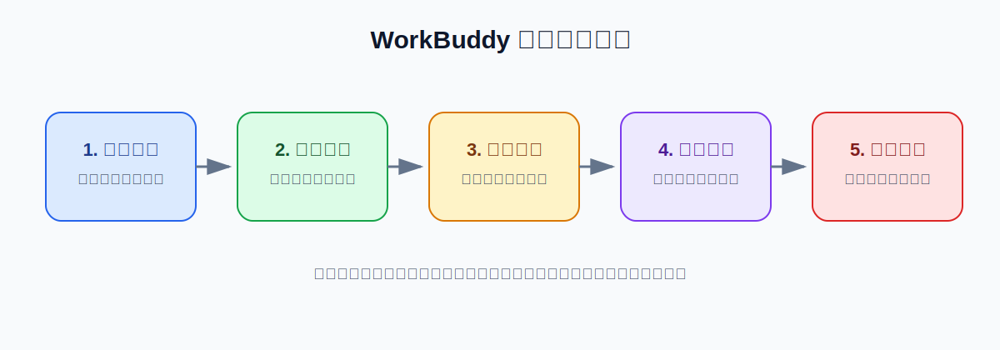

# 教程标题

> 验证状态：C 级自动草稿，等待人工核对和实测，不应作为已确认步骤直接发布。

## 这篇教程解决什么问题

说明用户的真实目标、最终交付物，以及为什么普通的一句话容易失败。



## 适合谁

- 适用人群；
- 典型工作场景；
- 不适用或需要额外专业确认的人群。

## 完成后会得到什么

- 结果文件；
- 报告或表格；
- 进度清单；
- 验证报告。

## 开始前需要准备什么

| 项目 | 建议 |
|---|---|
| 预计耗时 | 约 20 分钟 |
| 工作模式 | Plan，确认计划后再 Craft |
| 模型 | 自动模式或说明原因 |
| Skill | 列出所需 Skill，没有则写“无” |
| 连接器 | 列出所需连接器，没有则写“无” |
| 工作目录 | 使用独立测试目录 |
| 权限 | 默认权限 |
| 输入文件 | 只使用副本和脱敏数据 |

## 先创建安全工作目录

```text
example-job/
├── input/       # 原文件副本
├── work/        # 中间文件
├── output/      # 最终结果
└── logs/        # 清单、错误和验证记录
```

说明如何创建目录，以及哪些文件不能直接放进去。

## 操作步骤

### 第一步：检查输入

说明：

- 用户应该做什么；
- WorkBuddy 应该读取什么；
- 此时不允许修改什么；
- 应该生成哪个清单或预览。

```text
请先检查……
现在不要正式执行，不要修改原文件。
```

**成功标志：** `logs/inventory.md` 已生成，可以打开，并且输入范围正确。

**失败时停止：** 找不到文件、格式不支持、权限错误或清单范围不正确时，不要进入下一步。

> 配图：实际界面截图或本步骤的 SVG 示意图。

### 第二步：生成执行计划

```text
请根据清单制定计划，说明步骤、输出、风险、恢复方式和需要我确认的操作。
现在只输出计划，不要执行。
```

**成功标志：** 计划明确写出输入、输出、批次、风险和恢复方法。

### 第三步：小样测试

```text
请只处理一个正常样本、一个复杂样本和一个边界样本。
结果保存到 work/sample/，不要继续处理全部内容。
```

**成功标志：** 小样结果可打开、格式正确、内容可以抽查。

### 第四步：正式执行

描述分批、检查点、文件命名和每批验收要求。

### 第五步：合并和验收

说明最终结果如何生成、如何抽查，以及未完成内容如何标记。

## 一条可以直接复制的完整任务描述

```text
请帮我完成【任务目标】。

输入：
- 【文件或目录】

处理流程：
1. 先检查输入并生成清单；
2. 先制定计划，等我确认；
3. 先做小样测试；
4. 按批次执行并记录进度；
5. 合并结果并生成验证报告。

输出：
- 保存到 output/；
- 完成后列出所有新建、修改、移动和删除的文件；
- 说明仍需人工确认的内容。

限制：
- 不修改、覆盖、移动、重命名或删除 input/ 中的文件；
- 不访问工作目录之外的位置；
- 不确定的信息标记“待确认”；
- 涉及联网、运行脚本、安装工具、发送、发布、删除或完全访问时先询问我。
```

## 结果文件应该是什么样

列出：

- 文件名；
- 保存路径；
- 必须包含的章节或字段；
- 不能包含的内容；
- 一个明确标记为“示例结果”的结构示意。

## 怎么判断成功

- 输入范围正确；
- 原文件未修改；
- 输出文件可以打开；
- 数字、页码、时间戳或来源可以抽查；
- 没有未说明的失败批次；
- WorkBuddy 的变更列表与磁盘实际情况一致；
- 仍不确定的内容已明确标记。

## 常见问题

### 问题一：表现

- 可能原因；
- 排查顺序；
- 是否需要更换模型或 Skill；
- 已验证或待验证；
- 什么情况下应停止操作。

### 问题二：表现

同上。

## 撤销、恢复和重新执行

说明：

- 如何备份；
- 如何恢复原文件；
- 如何根据检查点续跑；
- 如何避免重复执行；
- 哪些中间文件暂时不能删除。

## 权限、隐私和数据去向

明确说明：

- 本地文件不等于完全离线；
- 当前模型是否可能接触文件内容；
- Skill 和连接器是否调用第三方服务；
- 哪些数据应脱敏；
- 哪些操作必须人工确认；
- 如何撤销授权。

## 配图清单

- [ ] 图 1：任务整体流程；
- [ ] 图 2：工作目录或准备材料；
- [ ] 图 3：WorkBuddy 关键操作界面；
- [ ] 图 4：处理逻辑或分批流程；
- [ ] 图 5：结果和验收；
- [ ] 图 6：失败恢复和安全边界。

## 参考资料

### 官方资料

- [来源名称](https://example.com/official-source)

### 社区教程与问题

- [来源名称](https://example.com/community-source)——只用于交叉核对和发现内容缺口。

## 更新记录

- YYYY-MM-DD：搜集来源并创建 C 级草稿；
- YYYY-MM-DD：完成来源核对，升级为 B 级；
- YYYY-MM-DD：完成实际测试和截图，升级为 A 级。
